# You Betcha!

[](https://opensource.org/licenses/MIT)


## Description

This app provides a way for people to bet their friends, track those bets, post the outcomes of those benefits (embarrasing or triumphant!) and keeps those records amongst friends. A Social Network designed for bragging rights - can you compete?


## User Story

```md
AS an insanely competitive person,
I WANT to track bets with friends
SO THAT I can have tangible evidence of my superiority.

```


## Table of Contents

  - [Description](#description)
  - [User Story](#user-story)
  - [Installation](#installation)
  - [Usage](#usage)
  - [License](#license)
  - [Contributing Guidelines](#contributing-guidelines)
  - [Tests](#tests)
  - [Languages, Skills and Credits](#languages-skills-and-credits)
  - [Screenshots of Wireframe](#screenshots-of-wireframe)
  - [Screenshots of Application](#screenshots-of-application)
  - [Questions & Links](#questions-&-links)


## Installation
```

- Clone the repository
- Run 'npm init' and then 'npm install'
- run 'npm run develop' to begin the execution of the project

```

## Usage

The application runs via the root directory by typing ``npm run start`` into your terminal, followed by ``mongod`` in a 2nd terminal.

## License

Distributed under the **MIT** license.


## Contributing Guidelines

Contributions help our open source community to continue to evolve, and any contributions are greatly appreciated. If you have a suggestion that would improve this code please follow the directions below. I require that any and all changes adhere to the Code of Conduct outlined in the [Contributor Covenant](https://www.contributor-covenant.org/).

## Tests

At this time, no tests have been documented for this application.

## Languages, Skills and Credits

- Javascript
- ReactJS
- Node.js
- [Express](https://www.npmjs.com/package/express) is the webserver framework for Node.js.
- [MongoDB](https://www.mongodb.com/) provides access to apis from the backend to the browser.
- [Mongoose](https://www.npmjs.com/package/mongoose) is used to execute CRUD operations.
- [Apollo-Server](https://www.npmjs.com/package/apollo-server-express) is used to initialize the database.
- [GraphQL](https://graphql.org/) is used for fulfilling our queries with existing data.
- [Material-UI](https://mui.com/) is used to design the UI alongside React.
- [JWT](https://www.npmjs.com/package/jwt) is used to hash/encrypt passwords in the database to protect our user's privacy. 
- [dotenv](https://www.npmjs.com/package/dotenv) is used to host credentials in the environment file.
- Balsamiq used for the wireframe design.

## Screenshots of Wireframe

### **Login Design**

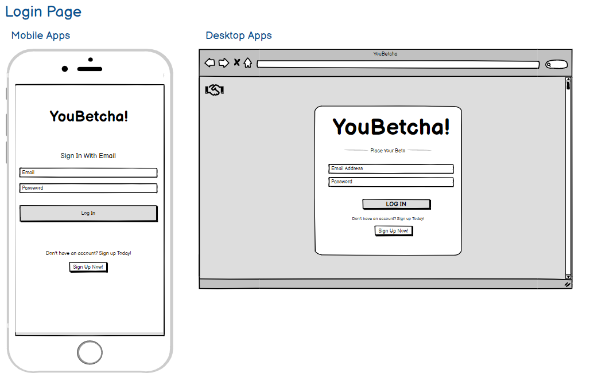

### **Sign Up Design**

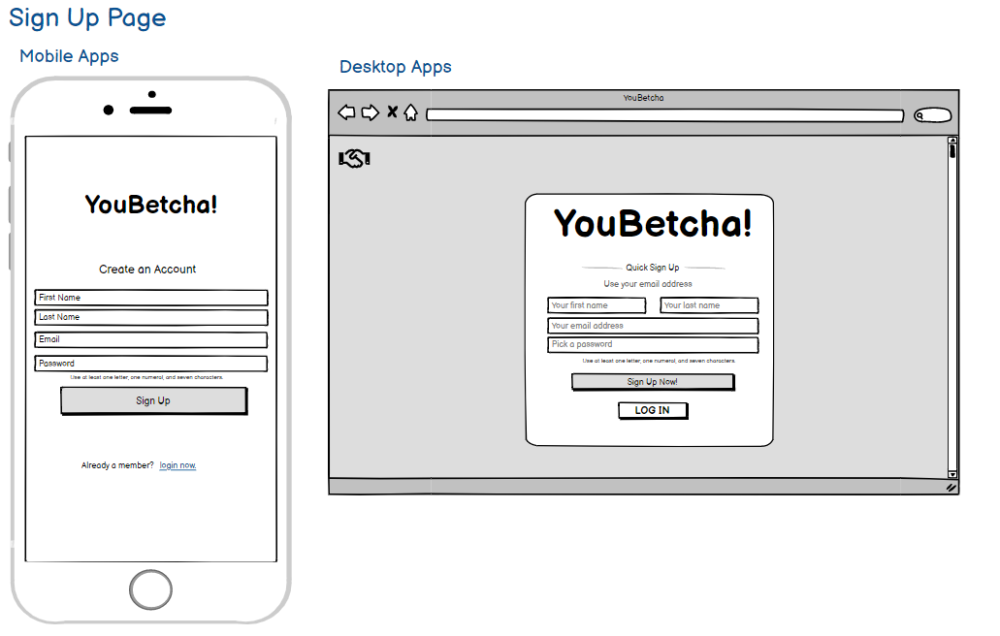

### **Homepage/Feed Design**

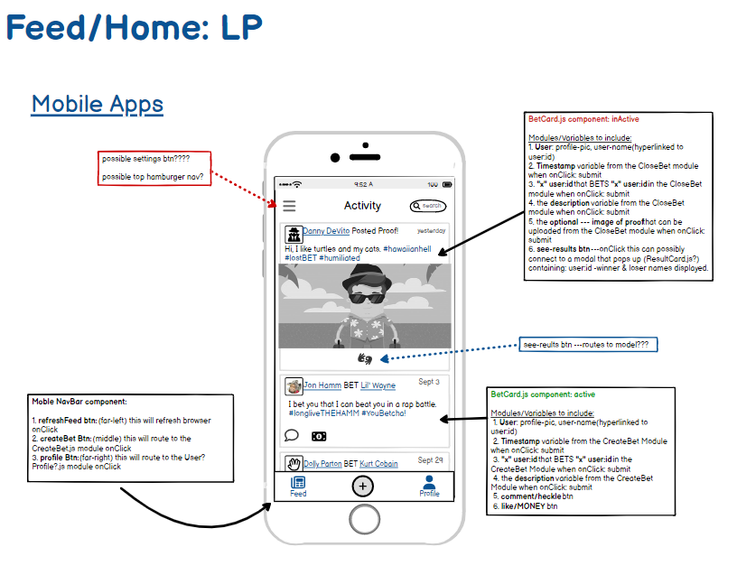 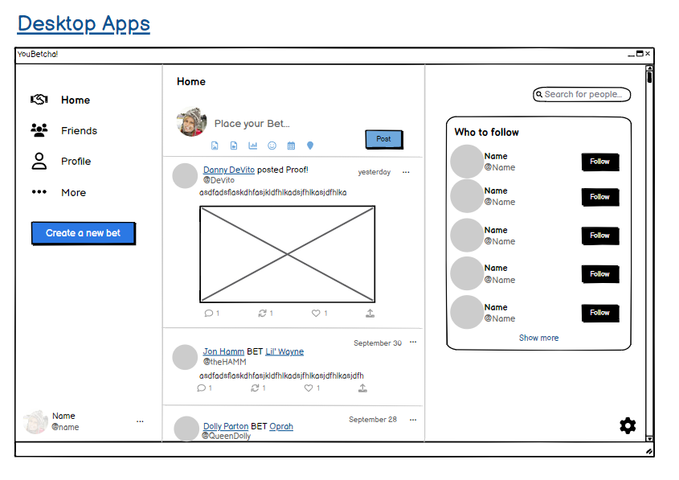

### **Profile/Make a Bet UX Flow**

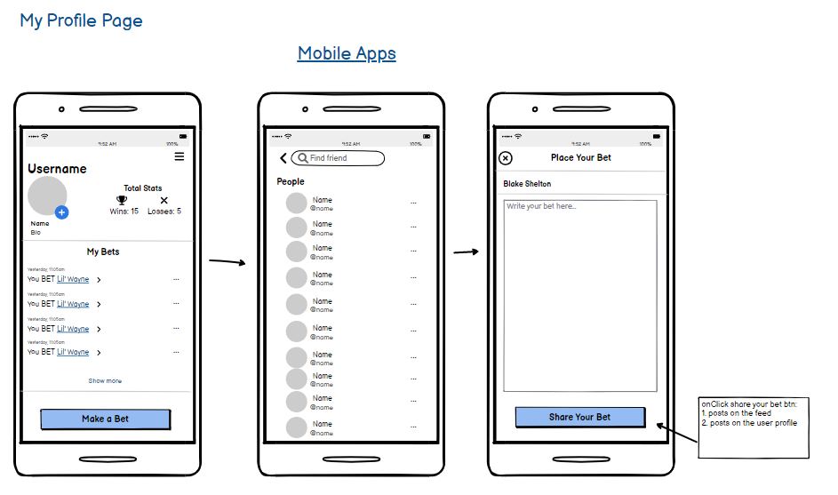 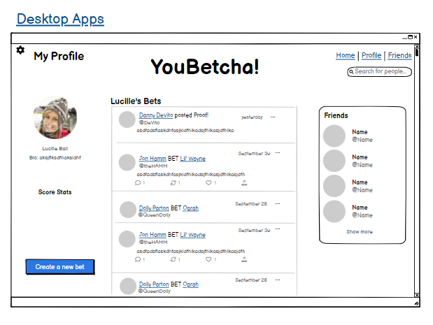

## Screenshots of Application

### **Login**

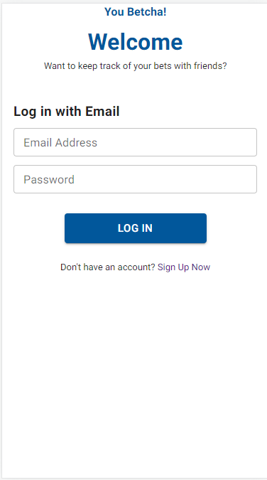

### **Sign Up**

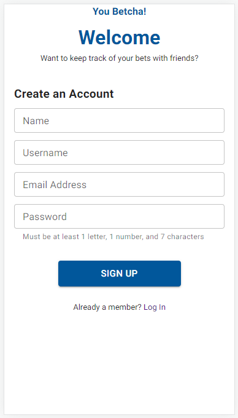

### **Homepage/Feed**

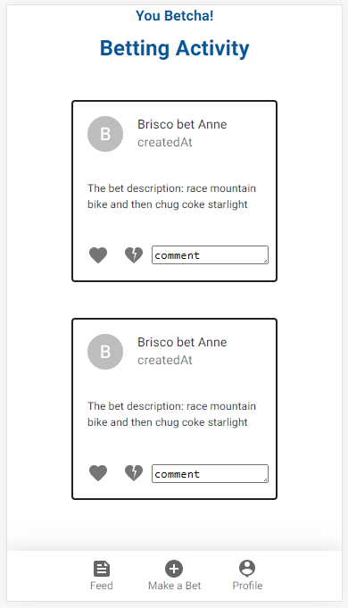

### **Make Your Bet**

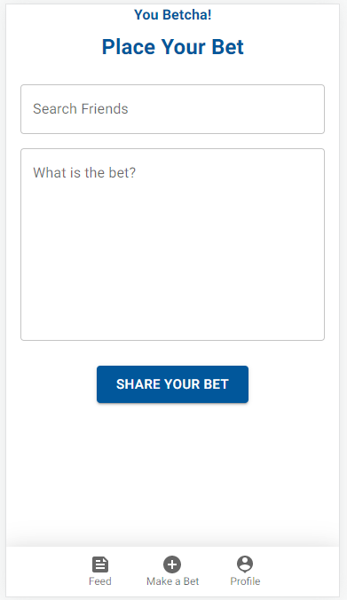

### **Profile View**

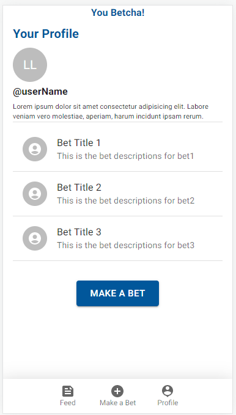

-----
## Questions & Links

Please reach out with any questions you may have about this application.

To view the Heroku deployed link, [click here.](https://damp-hamlet-25881.herokuapp.com/)

Contact the creators: [Anne Linger](https://github.com/amccorkl), [Brisco Arechederra](https://github.com/brisco13), [Lindsey Lansford](https://github.com/lindsey-lansford), [Rachel Zaramba](https://github.com/rzaramba), and [Solen Iyassu](https://github.com/SolenIyassu)

