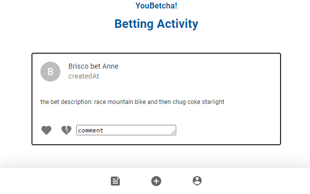
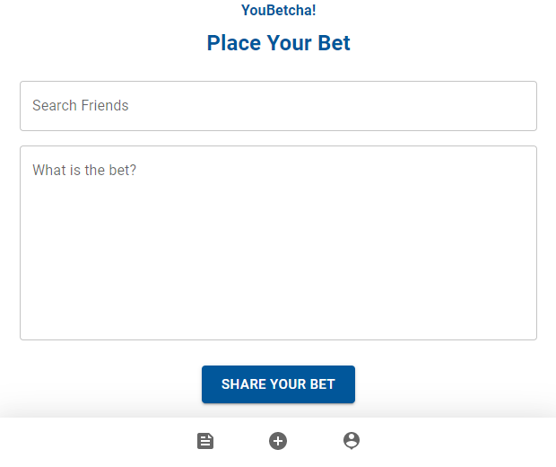
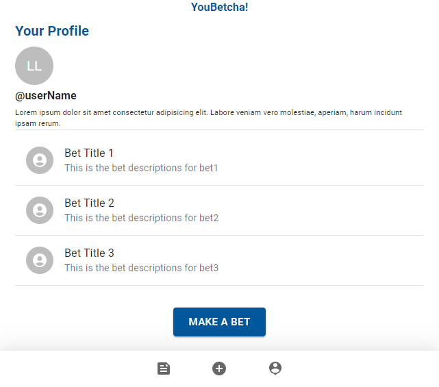
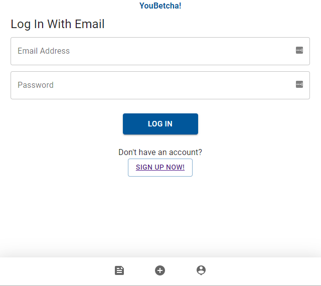
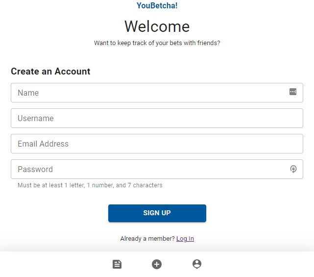

# YouBetcha!


[](https://opensource.org/licenses/MIT)


## Description

This app provides a way to for people to bet their friends, track those bets, post the outcomes of those benefits (embarrasing or triumphant!) and keeps those records amongst friends. A Social Network designed for bragging rights - can you compete?


## User Story

```md
AS an insanely competitive person,
I WANT to track bets with friends
SO THAT I can have tangible evidence of my superiority.

```

<details>
<summary><strong>Table of Contents</strong></summary>

  - [Description](#description)
  - [User Story](#user-story)
  - [Installation](#installation)
  - [Usage](#usage)
  - [License](#license)
  - [Contributing Guidelines](#contributing-guidelines)
  - [Tests](#tests)
  - [Languages, Skills and Credits](#languages-skills-and-credits)
  - [Screenshots](#screenshots)
  - [Questions and Links](#questions-and-links)
</details>


## Installation 
```
You can access this project here: (put link here) or download and investigate what makes YouBetcha! work!

- Clone the repository
- Run 'npm init' and then 'npm install'
- run 'npm run develop' to begin the execution of the project

```

## Usage
```
From the root directory, type in 'node index.js' or 'npm run start'
```

## License
Distributed under the **MIT** license.

## Contributing Guidelines
Contributions help our open source community to continue to evolve, and any contributions are greatly appreciated. If you have a suggestion that would improve this code please follow the directions below. I require that any and all changes adhere to the Code of Conduct outlined in the [Contributor Covenant](https://www.contributor-covenant.org/).

## Tests
There are currently no tests written for this application.

## Languages, Skills and Credits

- Javascript
- Node.js
- [Express](https://www.npmjs.com/package/express) is the webserver framework for Node.js.
- [Mongoose](https://www.npmjs.com/package/mongoose) is used to execute SQL code and CRUD operations.
- [Apollo-Server](https://www.npmjs.com/package/apollo-server-express) is used to initialize the database.
- [dotenv](https://www.npmjs.com/package/dotenv) is used to host credentials in the environment file. 
- [GraphQL](https://graphql.org/) is used to push the ingredient list to the user's email.
- [Material-UI](https://mui.com/)is used to design the layout and look of the app.
- [jwt](https://www.npmjs.com/package/jwt) is used to hash passwords.
- [MongoDB](https://www.mongodb.com/) provides access to apis from the backend to the browser.

## Screenshots

Home Page/Feed



Make Your Bet



Profile View



Login



Sign Up



## Questions Links
[Deployed Link](https://damp-hamlet-25881.herokuapp.com/)
Github repository for [YouBetcha!](https://github.com/brisco13/YouBetcha)

Contact the creators: [Anne Linger](https://github.com/amccorkl), [Brisco Arechederra](https://github.com/brisco13), [Lindsey Lansford](https://github.com/lindsey-lansford), [Rachel Zaramba](https://github.com/rzaramba),  and [Solen Iyassu](https://github.com/SolenIyassu)

